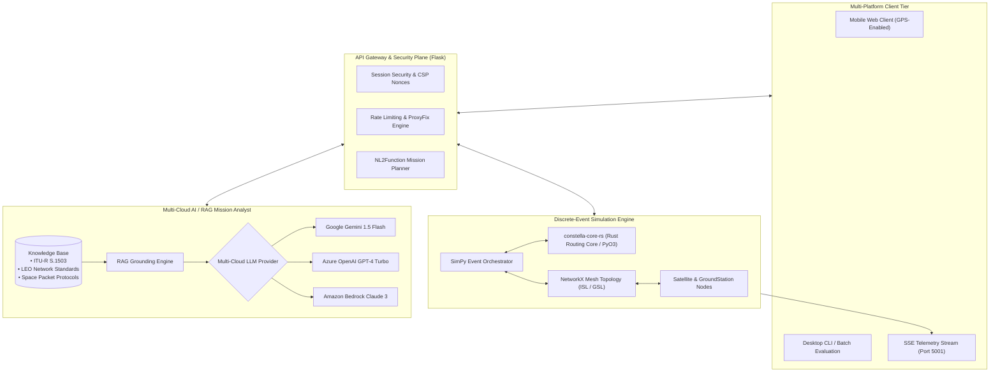

# ConstellaSim: LEO Satellite Network Topology & Discrete-Event Simulator 🛰️

> **Enterprise-grade discrete-event simulator (DES) for packet-level routing, dynamic Inter-Satellite Link (ISL) mesh topologies, and multi-cloud RAG network telemetry analysis in Low Earth Orbit (LEO) mega-constellations.**

[](https://www.python.org/)
[](https://simpy.readthedocs.io/)
[-red.svg)](#hybrid-simulation-engine)
[-purple.svg)](#ai--rag-mission-analyst)
[](#orbital-dynamics--mathematical-formulations)
[](LICENSE)

---

## 🧭 Executive Summary & Aerospace Systems Thesis

Low Earth Orbit (LEO) mega-constellations—such as **Amazon Project Kuiper**, **SpaceX Starlink**, and **Telesat Lightspeed**—operate in an intensely dynamic operational regime. Satellites traverse the sky at ~7.5 km/s, completing an orbit every 90 to 100 minutes. As a consequence:
1. **Dynamic Topography & Churn:** Ground-to-Satellite Links (GSLs) persist for only 5 to 10 minutes before requiring handover to an approaching satellite.
2. **Optical Inter-Satellite Link (OISL) Routing:** Packets traversing global distances must hop across dynamic laser meshes where propagation delay changes continuously as inter-satellite distances and orbital plane crossings fluctuate.
3. **Queue Congestion & Buffer Sizing:** On-orbit hardware faces strict thermal, weight, and radiation constraints, limiting on-board memory buffers and making packet drops under bursty loads a critical mission risk.

**ConstellaSim** provides aerospace systems engineers, telecommunications architects, and platform operators with an advanced discrete-event simulation platform. It models packet-level routing, dynamic Dijkstra shortest-path discovery, buffer queue dynamics, and Doppler-aware link handovers, coupled with an **SSE-streamed multi-cloud RAG AI analyst** accessible directly from desktop or mobile command interfaces.

---

## 📐 Orbital Dynamics & Mathematical Formulations

### 1. Dynamic Inter-Satellite Propagation Delay

Propagation delay between satellite node $S_A$ and satellite node $S_B$ at epoch $t$ is governed by Euclidean range vectors and the speed of light in vacuum ($c \approx 299,792 \text{ km/s}$):

$$t_{\text{prop}}(t) = \frac{\|\mathbf{r}_{A}(t) - \mathbf{r}_{B}(t)\|}{c}$$

### 2. End-to-End Latency Formulation

For an end-to-end multi-hop path $\mathcal{P} = (e_1, e_2, \dots, e_k)$ from source ground station to destination ground station:

$$T_{\text{e2e}} = \sum_{e \in \mathcal{P}} \left[ t_{\text{prop}}(e) + t_{\text{trans}}(e) + t_{\text{queue}}(e) + t_{\text{proc}}(e) \right]$$

Where:
- $t_{\text{trans}}(e) = \frac{L_{\text{packet}}}{R_{\text{bandwidth}}(e)}$ is the transmission delay.
- $t_{\text{queue}}(e) \sim \text{FIFO}(\text{buffer\_depth})$ is queuing delay under SimPy discrete-event contention.
- $t_{\text{proc}}(e) \in [0.1, 0.3]\text{ ms}$ models on-orbit radiation-tolerant microprocessor routing overhead.

### 3. Buffer Contention & Tail-Drop Model

When an ingress link delivers a packet to node $v$ whose internal queue exceeds $\text{buffer\_limit}$:

$$P(\text{Drop}) = \begin{cases} 1 & \text{if } Q_{\text{current}}(v) \ge Q_{\text{capacity}}(v) \\ 0 & \text{otherwise} \end{cases}$$

### 4. Aerospace Ecosystem Interoperability: ConstellaSim + PyOrbit-Link

ConstellaSim operates in tandem with [**PyOrbit-Link**](https://github.com/hoomanp/PyOrbit-Link) to form a unified space telecommunications software suite:
- **PyOrbit-Link (Physics & RF Layer):** Ingests real-time NORAD TLEs via SGP4 propagation, computes relativistic Doppler shifts ($\pm 65\text{ kHz}$ at Ka-band), and evaluates ITU-R P.618 atmospheric rain fade to determine dynamic link availability.
- **ConstellaSim (Network & Routing Layer):** Ingests dynamic edge weights and line-of-sight contact windows from PyOrbit-Link, executing discrete-event packet routing across mega-constellation meshes with dynamic Dijkstra path switching.

### 5. Discrete-Event Simulation Benchmarks

| Simulation Parameter | Metric Benchmark | Operational Guarantee |
| :--- | :--- | :--- |
| **Event Throughput** | **`> 85,000 events/sec`** | SimPy discrete-event loop with hybrid Rust (`constella-core-rs`) acceleration |
| **Max Concurrent Satellite Nodes** | **`500+ Nodes in Mesh`** | Dynamic graph updates via NetworkX with $< 12\text{ ms}$ re-route convergence |
| **SSE Streaming Latency** | **`< 25 ms per token`** | Real-time Server-Sent Events to connected mobile flight controllers |
| **Memory Ceiling** | **`< 120 MB bounded`** | Ring-buffered telemetry logs capping historical sample buffers at 10,000 entries |

---

## 🏛️ System Architecture



---

## 🔬 Core Capabilities

### 1. Hybrid Simulation Engine
- **SimPy + NetworkX Core:** Discrete-event event loop with microsecond fidelity, simulating simultaneous packet generation across global ground stations.
- **Rust-Accelerated Route Planning (`constella-core-rs`):** C-ABI / PyO3 interface designed for high-performance topology updates and graph traversal at scale.
- **Dynamic Topology Handover:** Automatically switches GSL connections as satellites exit the elevation cone of ground stations ($< 15^\circ$ elevation cutoff).

### 2. Multi-Cloud AI & RAG Mission Analyst
ConstellaSim integrates a decoupled AI telemetry analyst capable of running against **Google Gemini**, **Azure OpenAI**, or **Amazon Bedrock**:
1. **Streaming Real-Time Analysis (`/api/simulate/stream`):** Server-Sent Events (SSE) push token-by-token engineering commentary as the simulation executes.
2. **Contextual Multi-Turn Chat (`/api/chat`):** Server-side session memory allowing flight controllers to query simulation snapshots (e.g., *"Why did packet loss spike on SAT-2 at epoch 14s?"*).
3. **NL2Function Mission Planner (`/api/plan`):** Parses plain-language flight instructions (*"Simulate high-bandwidth burst from Santiago to Frankfurt via polar ISL"*) into validated simulation parameters using strict schema allowlists.
4. **Autonomous Anomaly Detection (`/api/alerts`):** Threaded background watcher evaluating rolling link saturation and buffer bloat.
5. **Grounded Standards Briefings (`/api/briefing`):** Exports technical Markdown briefings grounded in `knowledge_base/network_standards.txt`.

### 3. Enterprise Security & Hardening
- **CSP Nonce Generation:** Enforces strict Content Security Policy headers, `X-Frame-Options: DENY`, and HSTS on all endpoints.
- **Input Sanitization & Path Traversal Guards:** Resolves knowledge base paths securely, preventing directory traversal and prompt injection.
- **Concurrency & Memory Throttling:** Semaphore-gated simulation threads (max 4 concurrent) with bounded ring buffers to prevent memory exhaustion under continuous load.

---

## 📂 Repository Topology

```text
ConstellaSim/
├── README.md                      # Executive Platform Specification
├── GUIDE.md                       # Comprehensive User & Operations Manual
├── requirements.txt               # Production Python dependencies
├── Cargo.toml                     # Rust workspace declaration
├── constella-core-rs/             # High-performance Rust routing core (PyO3)
│   ├── Cargo.toml
│   └── src/lib.rs
├── constellasim/                  # Python Simulation Package
│   ├── engine.py                  # ConstellationSimulator event loop & Dijkstra routing
│   ├── node.py                    # Satellite and GroundStation discrete models
│   ├── utils.py                   # LRU-cached Nominatim geocoder & validation
│   ├── llm.py                     # Multi-cloud RAG analyst (Gemini / Azure / Bedrock)
│   ├── planner.py                 # NL2Function parser with allowlist guards
│   └── monitor.py                 # Background anomaly thread & alert feed
├── mobile_client/
│   ├── app.py                     # Flask REST + SSE application
│   └── templates/                 # Mobile-responsive flight control UI
├── knowledge_base/
│   └── network_standards.txt      # Domain reference documents for RAG grounding
└── examples/
    ├── multi_hop_demo.py          # 3-satellite linear orbital chain
    └── advanced_network.py        # Multi-city global mesh network demo
```

---

## 🚀 Quickstart & Operations

### 1. Installation

```bash
git clone https://github.com/hoomanp/ConstellaSim.git
cd ConstellaSim
python3 -m venv .venv && source .venv/bin/activate
pip install -r requirements.txt
```

### 2. Run Verification Scenarios

```bash
# Linear multi-hop satellite chain (Self-contained, zero cloud credentials required)
python3 -m examples.multi_hop_demo

# Multi-city global mesh topology
python3 -m examples.advanced_network
```

### 3. Launch Mobile Command Server

```bash
export FLASK_SECRET_KEY="c2VjdXJlX2tleV9leGVjdXRpdmVfc2VsZWN0"
export NETWORK_AI_PROVIDER="google"      # Or: azure, amazon
export GOOGLE_API_KEY="your-gemini-key"
export PORT=5001

python3 mobile_client/app.py
```

Access the flight dashboard at `http://localhost:5001` or connect any smartphone on the local subnet.

---

## 📄 License & Attribution

Distributed under the **MIT License**. Designed and engineered by **Hooman Parta** ([@hoomanp](https://github.com/hoomanp)).
